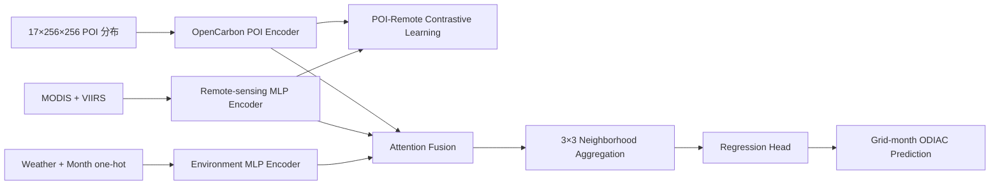

# OpenCarbon 跨空间迁移项目任务说明

> 文档版本：v1.0
> 更新时间：2026-07-21
> 项目目录：`D:\learn\PyCharm_Workplace\Carbon`
> 参考工作：OpenCarbon（IJCAI 2025）

## 1. 项目背景

OpenCarbon 使用卫星影像和 POI 空间分布预测 1 km 网格级碳排放，其核心设计包括：

1. 遥感与 POI 的跨模态表示学习；
2. 基于对比学习的跨模态信息对齐；
3. 基于注意力的模态融合；
4. 基于规则网格邻域的空间聚合；
5. 按区域划分训练集与测试集，评估未见区域上的泛化能力。

本项目在 OpenCarbon 的空间多模态建模框架上进行扩展。现有数据覆盖 Chicago、New York City、Singapore 和 Tokyo 四个城市，包含 2021 年 1 月至 2023 年 12 月的月度 ODIAC 碳排放、MODIS、VIIRS、POI 和天气数据。

本项目不把 36 个月视为时间序列输入，而是把每个城市的每个月视为一个独立的城市空间快照。研究重点是模型能否将从已见城市或已见区域中学习到的“城市功能—环境感知—碳排放”关系迁移到未见空间域。

## 2. 研究目标与边界

### 2.1 总体目标

建立一套基于 OpenCarbon 的月度网格碳排放预测框架，系统评估模型的两类空间迁移能力：

- 跨城市迁移：使用三个城市训练，直接预测一个完全未参与训练的城市；
- 城市内跨区域迁移：使用同一城市的部分行政区训练，直接预测未参与训练的行政区。

### 2.2 核心研究问题

1. 多模态开放数据能否重建不同城市的月度网格碳排放空间分布？
2. OpenCarbon 的 POI 空间编码、跨模态对比学习和邻域聚合是否能够提升跨城市泛化能力？
3. 模型能否从一个城市的已见行政区迁移到未见行政区？
4. 天气和月份信息能否在不引入历史排放的情况下改善月度空间预测？
5. 模型是否过度依赖 VIIRS 夜间灯光，从而复现 ODIAC 的空间分配规则？

### 2.3 项目范围

本阶段只研究同月空间估计：

\[
\hat y_{c,g,t}=f(X^{poi}_{c,g,t},X^{rs}_{c,g,t},X^{weather}_{c,g,t},X^{month}_{t},N_{c,g})
\]

其中：

- \(c\) 表示城市；
- \(g\) 表示 1 km 网格；
- \(t\) 表示月份；
- \(N_{c,g}\) 表示网格的空间邻域；
- \(\hat y_{c,g,t}\) 表示预测的当月 ODIAC 碳排放。

本阶段明确不包含：

- 使用历史碳排放作为输入；
- GRU、LSTM、TCN、Transformer 等时序模型；
- 预测未来的 \(t+1\) 或 \(t+3\) 月排放；
- 使用目标城市或目标行政区标签进行微调；
- region ID embedding 或 city ID embedding；
- 收集新的原始卫星影像。

## 3. 数据概况

### 3.1 数据规模

| 城市 | 网格数 | 月份数 | Grid-month 样本数 |
|---|---:|---:|---:|
| Chicago | 940 | 36 | 33,840 |
| NYC | 1,201 | 36 | 43,236 |
| Singapore | 926 | 36 | 33,336 |
| Tokyo | 905 | 36 | 32,580 |
| 合计 | 3,972 | 36 | 142,992 |

数据时间范围统一为 2021-01 至 2023-12，空间分辨率统一为约 1 km × 1 km。

### 3.2 原始目录

每个城市包含以下数据：

```text
raw_data/<city>/
├── <city>_grid_1km_odiac.geojson
├── CO2/
│   └── emission_panel_<year>.csv
├── modis/
│   └── rs_grid_<yyyymm>.csv
├── POI/
│   └── poi_grid_<yyyymm>.csv
├── poi_points/
│   └── poi_points_<yyyymm>.csv
├── VIIRS/
│   └── *.csv
└── weather/
    └── weather_openmeteo_monthly_<yyyymm>.csv
```

### 3.3 统一样本主键

所有模态使用以下联合主键对齐：

```text
city_id + cell_id + period
```

其中 `period` 使用 `YYYYMM` 格式。每个联合主键必须唯一对应一条网格月度样本。

## 4. 模型输入

### 4.1 POI 空间分布模态

主模型不直接使用 `poi_grid` 中的 POI 计数向量，而是使用 `poi_points` 构建与 OpenCarbon 同类型的 POI 空间分布张量。

#### 4.1.1 固定类别顺序

POI 张量包含 17 个通道，通道顺序固定为：

| 通道 | 类别 |
|---:|---|
| 0 | `poi_restaurant` |
| 1 | `poi_school` |
| 2 | `poi_university` |
| 3 | `poi_fuel` |
| 4 | `poi_hospital` |
| 5 | `poi_clinic` |
| 6 | `poi_shop` |
| 7 | `poi_tourism` |
| 8 | `poi_industrial_landuse` |
| 9 | `poi_commercial_landuse` |
| 10 | `poi_residential_landuse` |
| 11 | `poi_industrial_building` |
| 12 | `poi_commercial_building` |
| 13 | `poi_retail_building` |
| 14 | `poi_warehouse` |
| 15 | `poi_parking` |
| 16 | `poi_bus_station` |

#### 4.1.2 POI 栅格化

对每个 `city_id + cell_id + period`：

1. 读取网格 GeoJSON 中的网格边界；
2. 选取该网格内相同月份的 POI 点；
3. 将 1 km 网格内部归一化为 256×256 像素；
4. 根据 POI 点的网格内相对经纬度确定像素位置；
5. 根据 `category` 写入对应通道；
6. 同一像素、同一类别出现多个 POI 时累加计数；
7. 使用 north-up 方向，即纬度越高，像素行号越小；
8. 没有 POI 的网格输出全零张量。

主模型实际接收 channel-first 张量：

```text
[17, 256, 256]
```

边界点使用确定性规则分配：优先使用空间 `covers` 判断；若一个点同时落在多个相邻网格边界上，则分配给 `cell_id` 排序最小的网格。

#### 4.1.3 POI 存储形式

若将 142,992 个 POI 张量按 float32 密集保存，存储规模不可接受。因此 POI 数据采用稀疏落盘、批内密集还原：

```text
data/processed/poi_sparse/<city>/<period>.npz
```

每个城市月份分片至少保存：

```text
cell_id
cell_offset
pixel_y
pixel_x
channel
count
```

数据加载器在读取 batch 时，仅将当前 batch 需要的网格还原为 `[B, 17, 256, 256]` float32 张量。逻辑索引仍然精确到城市、月份和网格。

`poi_grid` 用于：

- 校验 POI 栅格各通道的聚合总数；
- 为 SVR、Random Forest、LightGBM、BPNN 等表格模型提供 POI 计数特征；
- 检查 POI 点数据与网格聚合数据是否一致。

### 4.2 MODIS 遥感模态

模型使用以下连续特征：

- `modis_ndvi_mean`；
- `modis_evi_mean`；
- `modis_red_reflectance_mean`；
- `modis_nir_reflectance_mean`；
- 四类特征对应的有效像元数量。

对四个遥感均值字段分别增加缺失标记。缺失值使用训练集统计量填补，不允许使用验证城市、测试城市或测试行政区统计量。

### 4.3 VIIRS 夜间灯光模态

模型使用：

- `ntl_radiance_mean`；
- `ntl_radiance_max`；
- `ntl_radiance_sum`；
- `ntl_valid_pixel_count`；
- `ntl_is_missing`；
- `ntl_is_imputed`。

夜光均值、最大值和总量使用 `log1p` 处理。已经存在的 `ntl_log_radiance_mean` 可直接使用，但不得同时重复输入原始均值和其对数版本。

### 4.4 Weather 模态

模型使用：

- `temperature_2m_mean_c`；
- `relative_humidity_2m_mean_pct`；
- `precipitation_sum_mm`；
- `wind_speed_10m_max_kmh`；
- `shortwave_radiation_sum_mj_m2`。

`api_lat` 和 `api_lon` 仅用于数据来源审计，不作为模型输入。

### 4.5 月份编码

从 `period` 中提取月份，生成 12 维 one-hot：

```text
January  -> [1, 0, ..., 0]
February -> [0, 1, ..., 0]
...
December -> [0, 0, ..., 1]
```

年份不作为模型输入。模型不能通过年份字段记忆 2021、2022 或 2023 的排放水平。

### 4.6 空间邻域

根据网格 `row` 和 `col` 构造以目标网格为中心的 3×3 邻域。不存在的相邻网格使用零向量和显式 neighbor mask 表示，不允许用任意有效网格代替缺失邻居。

### 4.7 禁止输入的字段

以下字段不进入主模型：

- 历史或当月真实 `emission_tc`；
- `city_id`；
- 行政区 ID；
- 原始 `lon`、`lat`；
- `global_row`、`global_col`；
- 数据源文件名和日期字符串；
- 测试域统计量生成的标准化特征。

## 5. 监督标签与模型输出

### 5.1 监督标签

监督标签为 ODIAC：

```text
emission_tc
```

单位为 tC/month。训练目标变换为：

\[
y^{log}_{c,g,t}=\log(1+y^{tc}_{c,g,t})
\]

### 5.2 输出变换

模型输出对数空间预测值 `y_pred_log`，原始单位预测为：

\[
\hat y^{tc}=\max(0,\exp(\hat y^{log})-1)
\]

### 5.3 标准预测文件

```text
outputs/predictions/<experiment>/<model>/<run_id>.parquet
```

字段至少包括：

| 字段 | 含义 |
|---|---|
| `experiment` | `cross_city` 或 `cross_region` |
| `model` | 模型名称 |
| `seed` | 随机种子 |
| `target_city` | 测试城市 |
| `target_admin_id` | 测试行政区；跨城市实验可为空 |
| `period` | 月份 |
| `cell_id` | 网格 ID |
| `y_true_log` | 对数真实值 |
| `y_pred_log` | 对数预测值 |
| `y_true_tc` | 原始 tC/month 真实值 |
| `y_pred_tc` | 原始 tC/month 预测值 |

## 6. 主模型设计

### 6.1 模型总体结构



### 6.2 POI 编码器

POI 分支使用与 OpenCarbon 同类型的卷积和 SE 编码器。输入通道由原实现的类别数量调整为当前数据的 17 类，其余核心结构保持一致。

```text
Input: [B, 17, 256, 256]

Conv2d(17, 32, kernel_size=7, stride=3, padding=3)
BatchNorm2d(32)
ReLU
SEModule(32)

Conv2d(32, 32, kernel_size=7, stride=3, padding=1)
BatchNorm2d(32)
ReLU
SEModule(32)

Conv2d(32, 1, kernel_size=3, stride=3, padding=1)
Flatten
Linear(100, representation_dim)
```

空间尺寸变化为：

```text
256×256 -> 86×86 -> 28×28 -> 10×10
```

### 6.3 遥感编码器

将 MODIS、VIIRS 和对应缺失标记拼接为遥感特征向量，经 MLP 映射至与 POI 表示相同的 `representation_dim`。

### 6.4 环境月份编码器

将五个天气特征和 12 维月份 one-hot 拼接，通过独立 MLP 编码。该分支用于提供季节与气象背景，不接收历史月份信息。

### 6.5 跨模态对比学习

保留 OpenCarbon 的 POI—遥感对比学习，以当前 batch 中同一个 grid-month 的 POI 表示和遥感表示作为正样本，不同样本作为负样本。

训练总损失为：

\[
\mathcal L = \mathcal L_{MAE}+\lambda_c\mathcal L_{contrastive}
\]

其中：

\[
\mathcal L_{MAE}=|\hat y^{log}-y^{log}|
\]

对比损失在预热阶段结束后启用，默认预热 100 个 epoch；`lambda_c` 仅使用训练域和验证域选择。

### 6.6 模态融合与邻域聚合

- POI、遥感、天气月份表示通过可学习注意力完成融合；
- 对每个网格收集 3×3 邻域的融合表示；
- 使用 OpenCarbon-style CNN 邻域编码和 cross-attention 聚合邻域上下文；
- 最终网格表示输入全连接回归头。

本阶段不使用 region embedding。

## 7. Baseline 与消融实验

### 7.1 表格 Baseline

- SVR；
- Random Forest；
- Stacked Random Forest Regression；
- LightGBM；
- BPNN/MLP。

这些模型使用网格级 POI 聚合计数、MODIS、VIIRS、Weather 和月份 one-hot，不使用 POI 256×256 空间张量。

### 7.2 空间与表示学习 Baseline

- CarbonGCN：网格为节点，空间相邻网格为边；
- PG-SimCLR-style：使用当前多模态特征构造空间对比学习模型；
- OpenCarbon-Core：POI 空间编码 + 遥感编码 + 对比学习 + 邻域聚合，不加入 Weather 和月份；
- OpenCarbon-Monthly：本项目主模型，加入 Weather 和月份编码。

READ 和 Tile2Vec 依赖原始卫星影像，本项目当前没有对应影像，因此不纳入本阶段 Baseline。

### 7.3 必要消融

| 消融 | 设置 |
|---|---|
| No Contrastive | 移除跨模态对比损失 |
| No Neighborhood | 只使用目标网格，不使用 3×3 邻域 |
| No Weather | 移除天气分支 |
| No Month | 移除月份 one-hot |
| No VIIRS | 完全移除夜间灯光特征 |
| No POI-SE | 保留 POI 卷积但移除 SE 模块 |
| POI Count Vector | 使用 `poi_grid` 计数 MLP 替代 POI 空间编码器 |

其中 No-VIIRS 是必须汇报的标签泄漏敏感性实验。

## 8. 实验一：跨城市 Zero-shot 预测

### 8.1 四轮划分

| 轮次 | 训练来源城市 | 测试城市 |
|---|---|---|
| 1 | NYC + Singapore + Tokyo | Chicago |
| 2 | Chicago + Singapore + Tokyo | NYC |
| 3 | Chicago + NYC + Tokyo | Singapore |
| 4 | Chicago + NYC + Singapore | Tokyo |

每轮训练和测试都包含相应城市的 36 个月快照。

### 8.2 严格 Zero-shot 约束

测试城市不得参与：

- 模型参数训练；
- 早停和超参数选择；
- 缺失值填补统计量计算；
- 特征均值和标准差计算；
- 类别映射学习；
- 模型微调。

POI 类别通道是四城预先统一的数据规范，不属于从目标城市学习的参数。

### 8.3 来源城市验证集

验证集只能从三个来源城市中产生：

1. 以行政区为最小不可拆分单元；
2. 每个来源城市确定性选取约 20% 行政区作为验证区；
3. 同一行政区的所有网格和所有月份只能属于一个集合；
4. 选择结果由 `seed + city_id + admin_id` 的稳定哈希确定；
5. 划分结果写入 split manifest，后续模型共用同一划分。

## 9. 实验二：城市内逐行政区留出

### 9.1 行政区定义

| 城市 | 行政单元 |
|---|---|
| Chicago | Community Areas |
| NYC | Community Districts |
| Singapore | Planning Areas |
| Tokyo | 23 Special Wards |

行政边界文件需保存来源、下载日期、版本和许可证。

### 9.2 网格行政区映射

1. 将行政区边界统一到网格 GeoJSON 的坐标系；
2. 使用网格中心点进行空间连接；
3. 中心点未匹配时，使用最大相交面积行政区作为回退；
4. 每个网格只能对应一个行政区；
5. 映射结果保存至 `data/processed/admin_grid_mapping.parquet`。

### 9.3 Leave-one-administrative-region-out

对城市中的每个有效行政区 \(r\)：

- 测试集：行政区 \(r\) 的全部网格和 36 个月；
- 候选训练域：该城市其余行政区；
- 验证集：从候选训练行政区中确定性选择约 20%；
- 训练集：剩余行政区的全部网格和月份。

有效行政区至少包含 5 个网格。少于 5 个网格的行政区仍记录预测结果，但不单独计算月度 R² 和 Spearman。

### 9.4 邻域边界防泄漏

按目标网格所属集合决定样本集合，同时对邻域进行严格屏蔽：

- 训练样本不得读取验证或测试行政区的邻域特征；
- 验证样本不得读取测试行政区特征；
- 测试样本默认只读取测试行政区内部邻域；
- 被屏蔽邻居使用零向量和 neighbor mask 表示。

该规则避免 OpenCarbon 邻域模块在训练期间提前观察测试区域。

## 10. 数据预处理与防泄漏规则

### 10.1 连续特征

- 长尾 POI 计数表格特征使用 `log1p`；
- VIIRS 辐射特征使用 `log1p`；
- 其他连续特征使用训练集均值和标准差进行标准化；
- 常数特征标准差置为 1，避免除零；
- 所有预处理参数随实验 fold 单独保存。

POI 256×256 分布保留像素计数，由 POI 编码器直接处理，不使用测试域统计量标准化。

### 10.2 缺失值

- MODIS 缺失值使用训练集特征中位数填补，并保留缺失标记；
- VIIRS 使用现有 `ntl_is_missing` 和 `ntl_is_imputed`；
- Weather 若出现缺失，同样使用训练集中位数并新增缺失标记；
- 测试域数据不得参与中位数计算；
- 本项目不使用前后月份插值，因为月份被定义为独立快照。

### 10.3 可复现性

最终结果使用三个随机种子：

```text
42, 43, 44
```

每次运行保存：

- 完整配置；
- Git 或代码版本信息；
- 数据版本与 split manifest；
- 训练日志；
- 最优模型检查点；
- 网格级预测结果；
- 月度与汇总指标。

## 11. 评估指标

### 11.1 月度评估

每个测试月份分别在当月测试网格上计算：

- 对数空间 R²；
- 对数空间 MAE；
- 对数空间 RMSE；
- 对数空间 Spearman 相关系数；
- 原始 tC/month MAE；
- 原始 tC/month RMSE。

随后对 36 个月的有效指标取均值和标准差。若某个月真实值为常数，R² 或 Spearman 记为 `NA`，不强制写为 0，并报告有效月份数量。

### 11.2 跨城市汇总

需要报告：

1. 四个目标城市各自的结果；
2. 四个城市等权宏平均；
3. 按网格数加权平均；
4. 每个目标城市三个随机种子的均值和标准差。

### 11.3 跨区域汇总

需要报告：

1. 每个有效行政区的 36 个月平均指标；
2. 每个城市的行政区等权宏平均；
3. 每个城市按行政区网格数加权的结果；
4. 四城市宏平均；
5. 小行政区和边界行政区的单独误差分析。

### 11.4 主指标

项目使用以下两个主指标：

- 对数空间 R²：衡量绝对排放拟合能力；
- 对数空间 Spearman：衡量高低排放网格的排序迁移能力。

MAE、RMSE 和原始 tC/month 指标作为补充，不使用 MAPE，因为数据包含大量零排放网格。

## 12. 标准产物

```text
data/
├── admin/
│   └── <city>_admin_boundaries.geojson
└── processed/
    ├── grid_month_panel.parquet
    ├── admin_grid_mapping.parquet
    └── poi_sparse/<city>/<period>.npz

splits/
├── cross_city/<target_city>/seed_<seed>.json
└── cross_region/<city>/<target_admin>/seed_<seed>.json

configs/
├── models/
└── experiments/

outputs/
├── checkpoints/
├── logs/
├── predictions/
├── metrics/
└── figures/
```

### 12.1 统一 Grid-month 数据表

`grid_month_panel.parquet` 至少包含：

```text
city_id
cell_id
period
row
col
admin_id
modis features
viirs features
weather features
poi count features
missingness flags
emission_tc
emission_log1p
```

### 12.2 指标文件

```text
outputs/metrics/monthly_metrics.parquet
outputs/metrics/fold_summary.parquet
outputs/metrics/city_summary.parquet
outputs/metrics/global_summary.parquet
```

## 13. 数据与实验验收标准

### 13.1 数据验收

- 四个城市均包含连续 36 个月；
- `city_id + cell_id + period` 全局唯一；
- 每城每月网格数与城市 GeoJSON 网格数一致；
- MODIS、VIIRS、POI、Weather 和 ODIAC 可按主键对齐；
- 排放单位统一为 tC/month；
- POI 类别严格属于固定 17 类；
- POI 稀疏栅格按通道聚合后与 `poi_grid` 对应类别计数一致；
- POI 像素方向为 north-up；
- 每个网格至多映射到一个行政区；
- 所有排除、缺失和异常情况都有审计报告。

### 13.2 划分验收

- 训练、验证和测试中心网格互不重叠；
- 同一行政区不会跨集合；
- 同一网格的 36 个月不会跨集合；
- 跨城市测试城市不参与任何训练统计；
- 邻域 mask 不允许训练样本读取测试行政区；
- split manifest 可完全复现划分。

### 13.3 模型与输出验收

- POI 编码器输入形状为 `[B, 17, 256, 256]`；
- 主模型不读取历史排放、城市 ID、行政区 ID或绝对经纬度；
- 所有模型使用相同训练、验证和测试划分；
- 预测经 `expm1` 反变换并截断为非负；
- 预测结果可按月、行政区和城市完整汇总；
- No-VIIRS 实验必须完成；
- 三个随机种子的结果完整保存；
- 每个汇总指标能追溯到网格级预测记录。

## 14. 实施任务拆解

### 阶段 1：数据审计与统一面板

- 校验四城 36 个月完整性；
- 合并 MODIS、VIIRS、Weather、POI count 和 ODIAC；
- 生成统一 grid-month 面板；
- 输出缺失值、异常值和排放分布报告。

### 阶段 2：行政区数据与划分

- 获取四城官方行政区边界；
- 建立网格—行政区映射；
- 生成跨城市和逐行政区留出 manifest；
- 实现邻域边界 mask；
- 编写划分防泄漏测试。

### 阶段 3：POI 空间输入

- 固定 17 类通道规范；
- 将 POI 点映射到网格和 256×256 像素；
- 生成稀疏城市月份分片；
- 实现 batch 内密集还原；
- 与 `poi_grid` 聚合计数逐通道核验。

### 阶段 4：Baseline

- 完成表格 Baseline；
- 完成 CarbonGCN；
- 完成 PG-SimCLR-style；
- 建立统一训练、预测和指标接口。

### 阶段 5：OpenCarbon 月度主模型

- 适配 17 通道 OpenCarbon POI 编码器；
- 实现遥感和环境月份编码器；
- 实现跨模态对比学习；
- 实现 3×3 邻域聚合与 mask；
- 完成 OpenCarbon-Core 和 OpenCarbon-Monthly。

### 阶段 6：完整实验与报告

- 执行四轮跨城市 zero-shot；
- 执行四城逐行政区留出；
- 执行三个随机种子；
- 完成必要消融和 No-VIIRS 实验；
- 输出月度、行政区、城市和全局汇总；
- 绘制预测地图、误差地图和跨域性能图。

## 15. 项目完成定义

同时满足以下条件时，本阶段项目视为完成：

1. 四城统一面板和 POI 空间输入通过数据验收；
2. 四轮严格跨城市 zero-shot 实验完成；
3. 四城逐行政区留出实验完成；
4. OpenCarbon 同类型 POI 编码器成功接收 17 通道月度 POI 分布；
5. 所有模型使用一致、无泄漏的实验划分；
6. 主模型、Baseline 和必要消融均有三个随机种子的结果；
7. R²、Spearman、MAE 和 RMSE 可从网格预测追溯并复算；
8. No-VIIRS 实验能够独立评估夜光潜在标签泄漏；
9. 代码、配置、数据版本、检查点、预测和指标文件均按统一目录保存；
10. 最终报告能够明确回答跨城市和城市内跨区域迁移是否有效。
